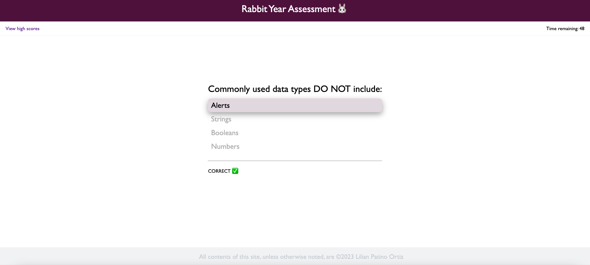

# Rabbit-Year-Assessment

### ~ Web APIs Challenge: Code Quiz 📝

## Description

This project allowed me to learn a lot about how to use jaascript to dynamically modify the DOM elements, how we can use timers and how we can use local storage to allow the user to keep their data without using a database! Great challenge :)

## Table of Contents (Optional)

If your README is long, add a table of contents to make it easy for users to find what they need.

- [Installation](#installation)
- [Usage](#usage)
- [Credits](#credits)
- [License](#license)

## Installation

To run the project in your local machine:

1. Open visual studio in your computer or laptop
2. Clone the git project: https://github.com/lilianpatinoortiz/Rabbit-Year-Assessment
3. Pull the latest from the 'main' branch
4. Locate the index.html file
5. Right click on the file and select "Open in default browser"
6. A new window on your default browser should open with the web page containing the project

Access the deployed project here: https://lilianpatinoortiz.github.io/Rabbit-Year-Assessment/

## Usage

After cloning and running the project you will be able to test your 2023 year's luck!

This is how the luck is tested: You have 75 seconds to answer all the questions - as fast as you can, for each wrong question 15 seconds will be substracted from your time. 
The game ends when you finish answering the questions or the time remaining is equals zero. Try getting the highest time remaining!

Check the scores saved in your local storage by clicking the upper left link, clear them and enjoy playing around!

## Credits

The main resources used:

- Bootcamp canvas - Module 04

## License

Please refer to the LICENSE in the repo.

